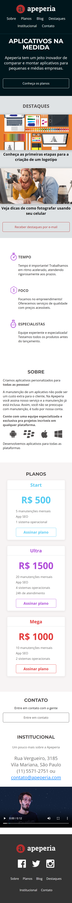

# Layouts Responsivos: trabalhando com layouts mobile

Clique [AQUI](https://alineviana.github.io/layouts-responsivos-alura/) para acessar o projeto

 

> ## 📝 Conteúdo: ✨ Layouts Responsivos: trabalhando com layouts mobile ✨
 

- Entendendo o processo de desenvolvimento de páginas web
- Emmet (ferramenta para agilizar a escrita de códigos)
- Manutenção de códigos com variáveis CSS
- Escrevendo códigos semânticos que ajudam na acessibilidade e SEO
- Adaptação de diferentes layouts
- Responsividade

 

> ## 🖥️ Tecnologias
 

- HTML5
- CSS3
